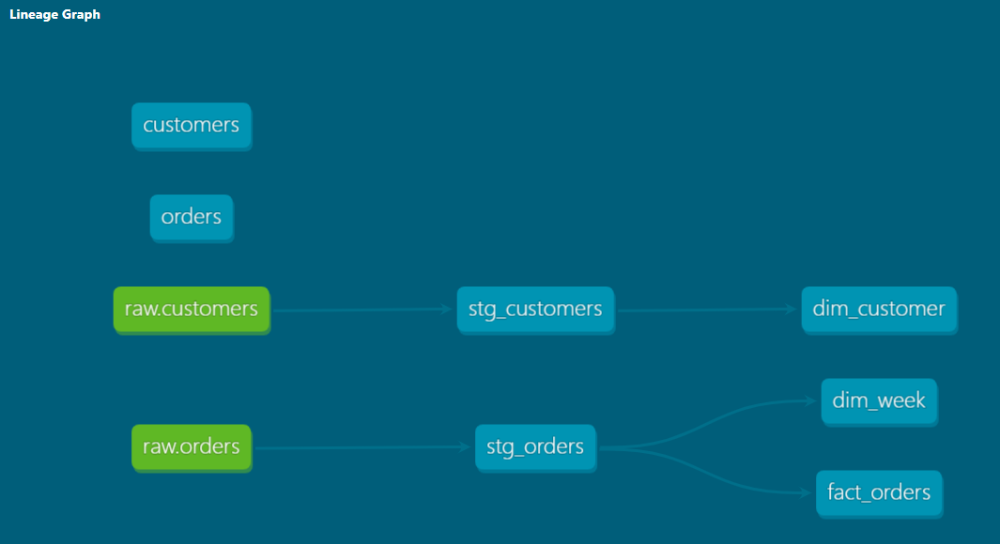

# Meal-Kit dbt Pipeline

A small dimensional data pipeline for a Nordic meal-kit subscription business, built with dbt and DuckDB.

Raw customer and order data is cleaned in a staging layer, then modeled into a star schema: one fact table (`fact_orders`) and two dimension tables (`dim_customer`, `dim_week`). Every model has tests attached, and a GitHub Actions workflow runs the full build on every push.

DuckDB is used as a free, local stand-in for a warehouse like Databricks or Snowflake. The dbt code itself is adapter-agnostic, so pointing it at a real warehouse is a config change, not a rewrite.

## Structure

```
seeds/            raw customer and order data (CSV)
models/staging/   1:1 cleanup of raw data. Renaming, type casting, no logic
models/marts/     dim_customer, dim_week, fact_orders. The actual data model
```

## Running it

```bash
python3 -m venv venv
source venv/bin/activate
pip install dbt-core dbt-duckdb
```

Add a `profiles.yml` in the project root:

```yaml
mealkit_pipeline:
  target: dev
  outputs:
    dev:
      type: duckdb
      path: mealkit.duckdb
      threads: 4
```

Then:

```bash
export DBT_PROFILES_DIR=.
dbt build
```

`dbt build` loads the seeds, builds every model, and runs all tests in dependency order.

## Data

Synthetic data generated for this project, customer signups, brand/region, weekly orders with pricing and delivery status.

## Lineage graph



Generated with `dbt docs generate && dbt docs serve`. Raw seeds flow through staging into the mart layer; `stg_orders` feeds both `dim_week` and `fact_orders`.

## Skills & tools

- dbt: sources, staging/mart model layering, `ref()`/`source()`, seeds, generic tests (`unique`, `not_null`, `relationships`), docs/lineage graph
- SQL: CTEs, type casting, derived columns, safe division (`nullif`)
- Dimensional modeling: star schema design, defining grain, fact vs. dimension tables
- DuckDB as a local warehouse
- Data quality testing (16 tests across staging and marts)
- Git / GitHub, GitHub Actions for CI
- YAML configuration (`dbt_project.yml`, schema/test files)

## Related project

[meal-kit-analytics](https://github.com/Bita-Panahi/meal-kit-analytics.git). The Streamlit dashboard this project's data originally comes from (churn risk, A/B test analysis, demand forecasting). This project rebuilds the same data as a modeled, tested pipeline instead of an analytics app.
