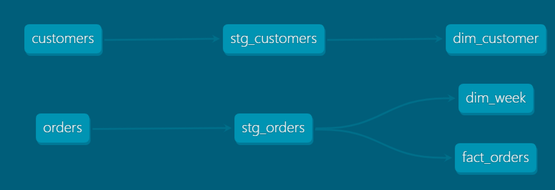
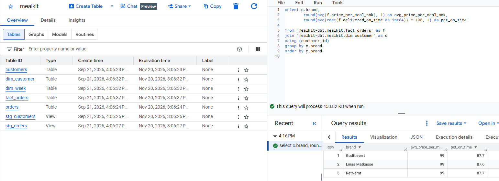

# Meal-Kit dbt Pipeline

A small dimensional data pipeline for a Nordic meal-kit subscription business, built with dbt, running on DuckDB locally and Google BigQuery in the cloud.

Raw customer and order data is cleaned in a staging layer, then modeled into a star schema: one fact table (`fact_orders`) and two dimension tables (`dim_customer`, `dim_week`). Every model has tests attached, and a GitHub Actions workflow runs the full build on every push.

DuckDB is used as a free, local warehouse for development and CI. The same models also run on Google BigQuery, which needed only a second dbt target and two small fixes.

## Structure

```
seeds/            raw customer and order data (CSV)
models/staging/   1:1 cleanup of raw data. Renaming, type casting, no logic
models/marts/     dim_customer, dim_week, fact_orders. The actual data model
```

## Running it

```bash
python3 -m venv venv
source venv/bin/activate
pip install dbt-core dbt-duckdb
```

Add a `profiles.yml` in the project root:

```yaml
mealkit_pipeline:
  target: dev
  outputs:
    dev:
      type: duckdb
      path: mealkit.duckdb
      threads: 4
```

Then:

```bash
export DBT_PROFILES_DIR=.
dbt build
```

`dbt build` loads the seeds, builds every model, and runs all tests in dependency order.

## Data

Synthetic data generated for this project, customer signups, brand/region, weekly orders with pricing and delivery status.

## Lineage graph



Generated with `dbt docs generate && dbt docs serve`. Raw seeds flow through staging into the mart layer; `stg_orders` feeds both `dim_week` and `fact_orders`.

## Running on BigQuery

The same models run on Google BigQuery through a second dbt target (`--target bq`).
I have made two changes to the project:

- Seeds are read with `ref()` instead of `source()`. Seeds are loaded by dbt itself, so `ref()` tells dbt that staging depends on them and it always loads the data first. With `source()`, a fresh BigQuery dataset failed because the staging views were created before the seed tables existed. DuckDB hid this because old tables were left over from earlier runs.

- The price column has an explicit type. `box_price_nok` is set to `numeric` in `dbt_project.yml`. dbt had thought that the type was `integer` from some values like `322.0`; so DuckDB had accepted it, but BigQuery had rejected because it's stricter. Also, for money, `numeric` is the right type. 


### How to run it

1. Create a Google Cloud project (the free BigQuery sandbox is enough).
2. Install the Google Cloud CLI and log in: `gcloud auth application-default login`
3. `pip install dbt-bigquery`
4. Add a `bq` output to `profiles.yml`:

```yaml
   bq:
     type: bigquery
     method: oauth
     project: <your-project-id>
     dataset: mealkit
     location: EU
     threads: 4
```

5. `dbt build --target bq`



CI still runs on DuckDB, so every push is tested without cloud credentials or cost.

## Skills & tools

- dbt: seeds with explicit column types, staging/mart model layering, `ref()`, generic tests (`unique`, `not_null`, `relationships`), docs/lineage graph
- SQL: CTEs, type casting, derived columns, safe division (`nullif`)
- Dimensional modeling: star schema design, defining grain, fact vs. dimension tables
- DuckDB as a local warehouse, Google BigQuery (EU) as a cloud warehouse
- Google Cloud CLI (OAuth / Application Default Credentials)
- Data quality testing (16 tests across staging and marts)
- Git / GitHub, GitHub Actions for CI
- YAML configuration (`dbt_project.yml`, schema/test files)

## Related project

[meal-kit-analytics](https://github.com/Bita-Panahi/meal-kit-analytics.git). The Streamlit dashboard this project's data originally comes from (churn risk, A/B test analysis, demand forecasting). This project rebuilds the same data as a modeled, tested pipeline instead of an analytics app.
